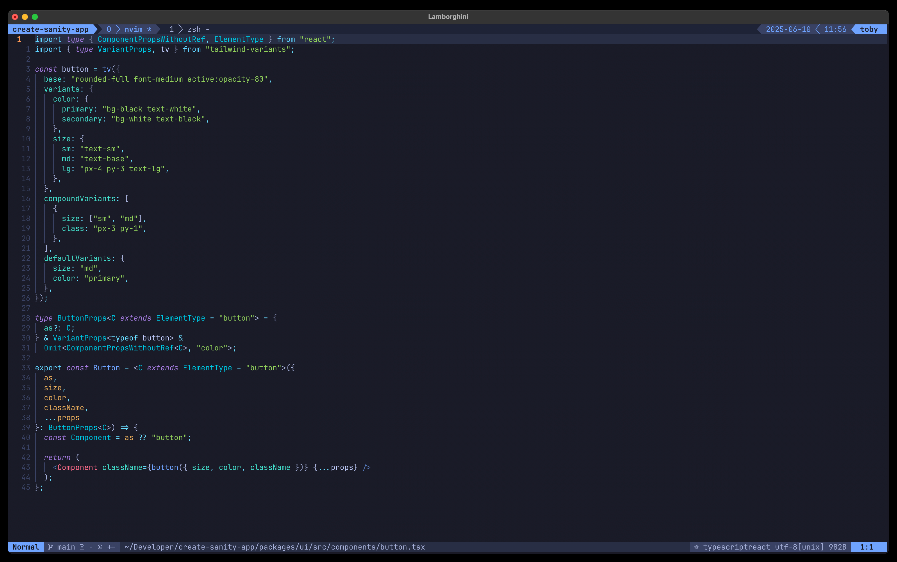

👋 Hi, I'm Toby. I am a full-stack engineer with 12+ years of professional experience. I like using things like TypeScript, React, Node, Next.js, NestJS, Tailwind CSS, Storybook, and Vitest.

When I write code you will find me working from Neovim and Tmux. My nvim config is a fork of https://github.com/nvim-lua/kickstart.nvim and looks something like this:

